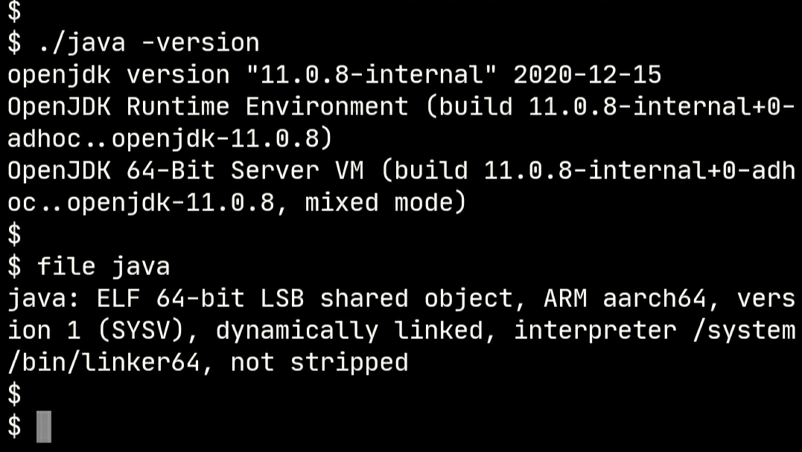
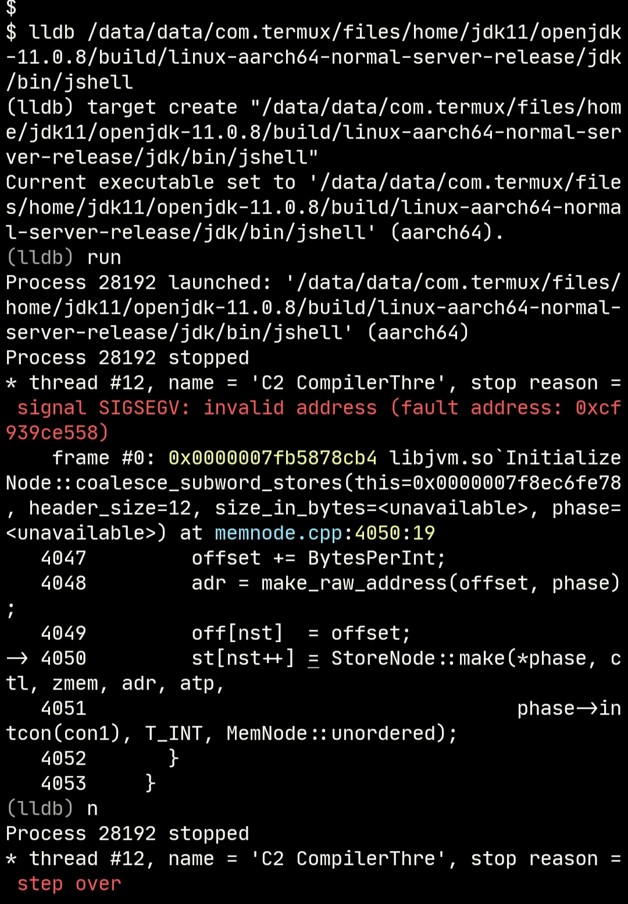
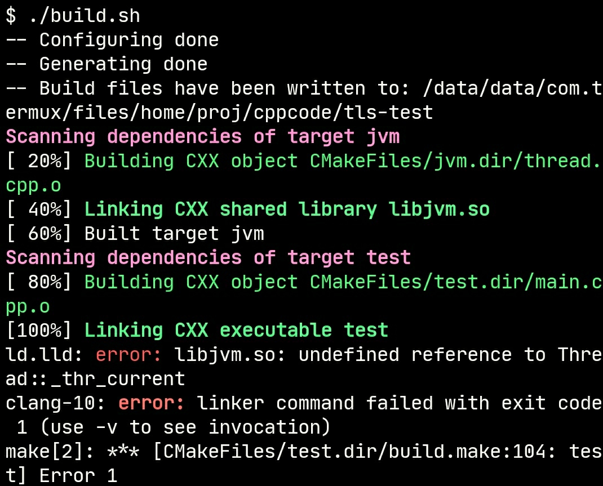

building openjdk-11 for Android with Termux

download the source code from [AdoptOpenJDK/openjdk-jdk11u](https://github.com/AdoptOpenJDK/openjdk-jdk11u) release


#### install boot JDK openjdk-11.0.1 from termux-ndk/release
```bash
tar -xJvf openjdk-11.0.1.tar.xz

vim /data/data/com.termux/files/usr/etc/bash.bashrc

export PATH=$PATH:/path/to/openjdk-11.0.1/bin
export JAVA_HOME=/path/to/openjdk-11.0.1

```


#### install X11 packages from x11-repo
```bash
apt install x11-repo
apt install libx11 libxext libxrender libxrandr libxtst libxt xorgproto fontconfig pulseaudio

```


#### building cups
```bash
git clone https://github.com/apple/cups
cd cups 
./configure --prefix=/path/to/libcups
make -j16
```


#### building alsa-lib
```bash
git clone https://github.com/alsa-project/alsa-lib
cd alsa-lib
./gitcompile
./configure --prefix=/path/to/alsa-lib
make -j16
```


#### building openjdk-11
```bash
# I downloaded openjdk-jdk11u-jdk-11.0.8-10_adopt from AdoptOpenJDK
# you can also download other versions

./configure \
    CC=clang \
    CXX=clang++ \
    --with-debug-level=release \
    --with-extra-cflags="-fPIC -fno-emulated-tls" \
    --with-extra-cxxflags="-fPIC -fno-emulated-tls -std=c++11" \
    --with-extra-ldflags="-fuse-ld=lld" \
    --with-toolchain-type="clang" \
    --with-x \
    --with-cups=/path/to/libcups \
    --with-alsa=/path/to/alsa-lib \
    --disable-warnings-as-errors

make JOBS=16

```


#### building finish
<a href="./img/java.jpg"></a>

 **** 


## Issues

1. jdk/lib/libxxx.so has linker warning: unsupported flags DT_FLAGS_1=0x81, please using termux-elf-cleaner to remove it. for example: termux-elf-cleaner \*.so


2. jshell has segmentation fault
<a href="./img/jshell_error.jpg"></a>


3. monotonic clock fix
   ```bash
   # get real libc.so path 
   # the dlopen function requires a real librt.so path
   # src/hotspot/os/linux/os_linux.cpp:1312:clock_init()

   # /system/lib64/libc.so -> /apex/com.android.runtime/lib64/bionic/libc.so
   ls -l /system/lib64/libc.so 

   # libc.so -> librt.so
   ln -sf /apex/com.android.runtime/lib64/bionic/libc.so /data/data/com.termux/files/usr/lib/librt.so

   # libc.so -> libpthread.so
   ln -sf /apex/com.android.runtime/lib64/bionic/libc.so /data/data/com.termux/files/usr/lib/libpthread.so

   ```


4. Android TLS(thread local storage) seems to have a bug, so add cxxflags -fno-emulated-tls to disable TLS supports, please refer [android-elf-tls](https://github.com/Lzhiyong/termux-ndk/blob/master/openjdk-build/android-elf-tls.md) for more information
   >ld.lld: error: libjvm.so: undefined reference to Thread::_thr_current , or libjvm.so: undefined reference to _ZN6Thread12_thr_currentE
   >
   >source files:
   >src/hotspot/share/utilities/thread.cpp
   >src/hotspot/os_cpu/linux_aarch64/threadLS_linux_aarch64.s


5. test if Android TLS working
   ```bash
   cd openjdk-build/tls-test
   ./build.sh
   ```

   On Android Failure
<a href="./img/tls_test1.jpg"></a>


   On TermuxArch (ArchLinux) Success
<a href="./img/tls_test2.jpg"></a>

 **** 
 
**If anyone knows, please submit an issue**

