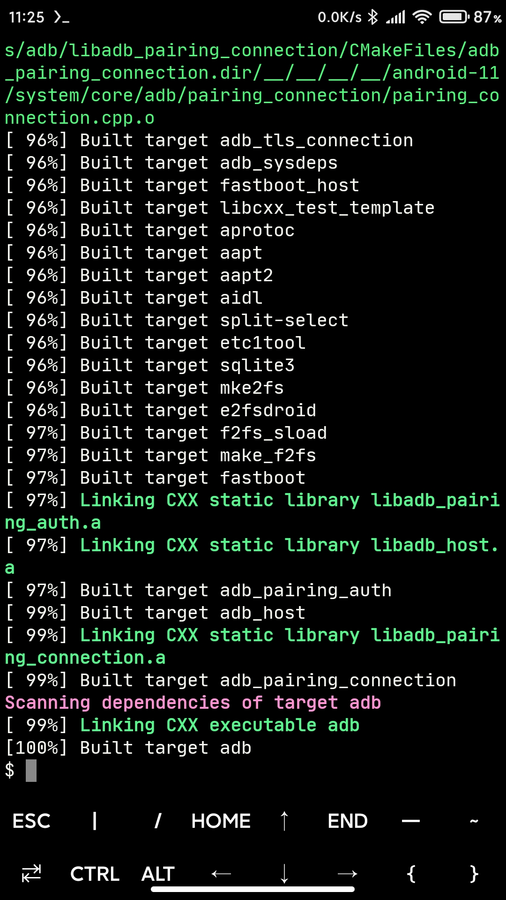
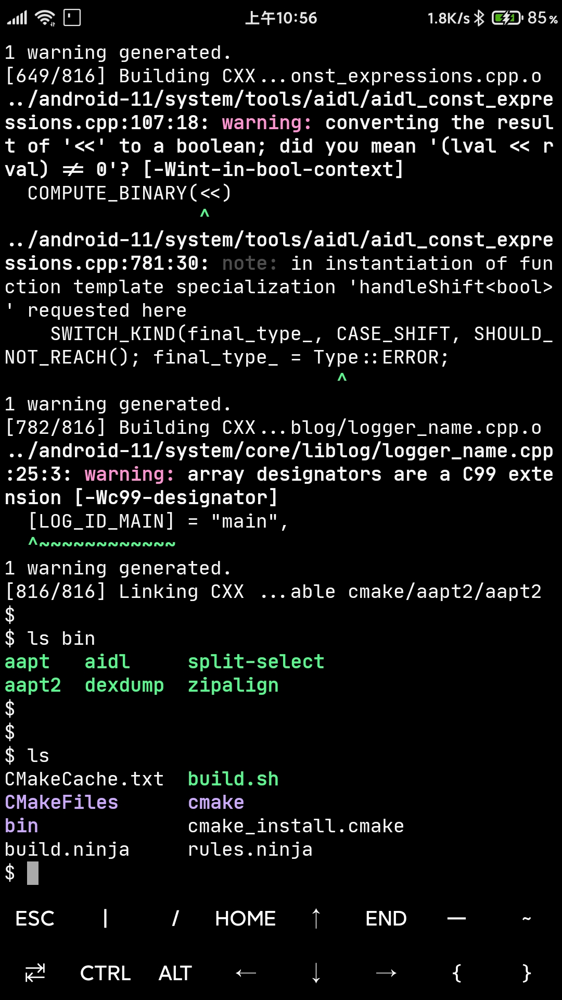
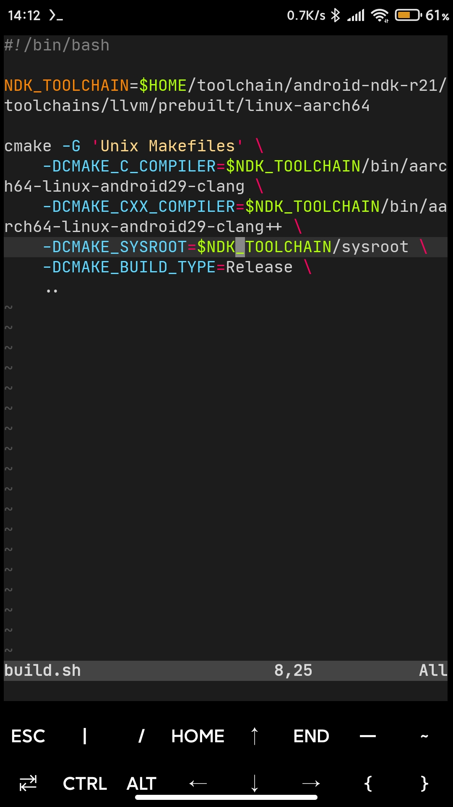

The source code from AOSP master branch

At first, we cannot directly use the termux to build AOSP, because blueprint and soong compilation fails for aarch64 architecture

So we use cmake to build each tool separately, which includes android-sdk/build-tools and platform-tools, such as aapt aapt2 aidl zipalign adb fastboot ... etc, If you need other tools, please add the CMakeLists.txt under cmake

Currently only supports aarch64 architecture, if you want to compile other architectures such as armeabi-v7a x86 x86_64, you need to refer to Android.bp to modify the corresponding CMakeLists.txt

The compiled binary files are placed in the [android-sdk](https://github.com/Lzhiyong/termux-ndk/releases)/build-tools and platform-tools

 **** 
### How to build

Termux needs to install aarch64 version of Linux. [TermuxArch](https://github.com/SDRausty/TermuxArch) 
is recommended, Of course you can also install other Linux distributions, ubuntu debian kali ... etc.

ArchLinux only downloads source code, we are not using it to compile.

you can use [termux-ndk](https://github.com/Lzhiyong/termux-ndk) or termux's clang to compile, 
please note if you use termux's clang to static compilation, need to pkg install ndk-multilib

```bash
# install repo
pacman -S repo

cd sdk-tools/android-11

# download source code
repo init -u https://android.googlesource.com/platform/manifest -b master

# for china
repo init -u https://mirrors.tuna.tsinghua.edu.cn/git/AOSP/platform/manifest -b master

repo sync -c -j4

# download finish, exit ArchLinux
exit


# start building...
cd sdk-tools && mkdir build && cd build

# settings the ndk toolchain
TOOLCHAIN=/path/to/android-ndk-r22/toolchains/llvm/prebuilt/linux-aarch64

cmake -G 'Ninja' \
    -DCMAKE_C_COMPILER=$TOOLCHAIN/bin/aarch64-linux-android30-clang \
    -DCMAKE_CXX_COMPILER=$TOOLCHAIN/bin/aarch64-linux-android30-clang++ \
    -DCMAKE_SYSROOT=$TOOLCHAIN/sysroot \
    -DCMAKE_BUILD_TYPE=Release \
    ..

ninja -j16
```

 **** 
### Screenshots

<a href="./screenshot/build_sdk_toos1.jpg"></a>
<a href="./screenshot/build_sdk_toos2.jpg"></a>
<a href="./screenshot/build_sdk_toos3.jpg"></a>


**** 
### Issues

Every Android version has a lot of changes, direct compilation will fail, you need to refer to the Android.bp file and modify the corresponding CMakeLists.txt and source code

aosp/external/boringssl has link errors, therefore you need to manually execute sdk-tools/cmake/lib/boringssl/build.sh to build libcrypto and libssl

adb dosen't support --fastdeploy option, because I don't know how to manually generate deployagent.inc and deployagentscript.inc header files

If anyone knows, please submit to issue

```bash
// from aosp/packages/modules/adb/Android.bp
// Note: using pipe for xxd to control the variable name generated
// the default name used by xxd is the path to the input file.
java_genrule {
    name: "bin2c_fastdeployagent",
    out: ["deployagent.inc"],
    srcs: [":deployagent"],
    cmd: "(echo 'unsigned char kDeployAgent[] = {' && xxd -i <$(in) && echo '};') > $(out)",
}

genrule {
    name: "bin2c_fastdeployagentscript",
    out: ["deployagentscript.inc"],
    srcs: ["fastdeploy/deployagent/deployagent.sh"],
    cmd: "(echo 'unsigned char kDeployAgentScript[] = {' && xxd -i <$(in) && echo '};') > $(out)",
}
```


reference [lizhangqu](https://github.com/lizhangqu/aapt-cmake-buildscript.git)
